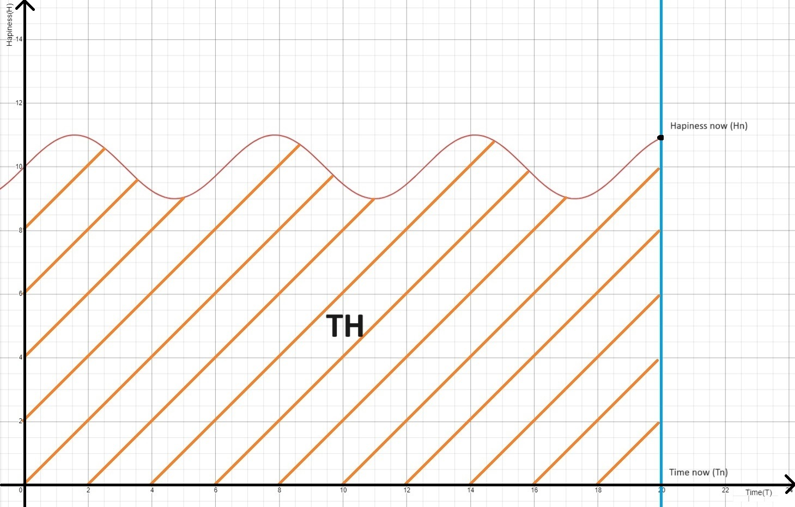

Основной принцип, который реализуется во всех перечисленных ролях:

**Максимизация *устойчивого* счастья на протяжении жизни, и избегания несчастья** 

В общем смысле подразумевает выработку такого характера, привычек и навыков, которые будут приводить к действиям нацеленным на долгосрочное улучшения собственного благополучия. Если условно представить благополучие как произведение времени и твоего счастья в этот момент времени - **T(Time) \* H (Happiness) = TH**, то становится понятно, что это достижимо путем увеличения времени жизни и счастья в каждый конкретный момент. Так же из этого следует, что  любое относительо короткое времяпровождение, нацеленное на улучшение счастья(даже в незначительной стемени) на значительно большем промежутке времени является приоритетным, даже если уменьшает счастье в момент самого времяпровождения. Обычно такое времяпровождение подразумевает построение чего-то, что будет тебе долго служить, если говорить о повышении счастья в будущем (построение отношений с близкими, приобритение знаний/навыков, закрытие материальных и не материальных долгов), либо отсутствием переживаний на тему маловероятных или не сильно болезненных проблем, когда за свое отсутствие забот мы платим потом, но в целом меньше чем, если бы переживали (не закрытые двери при уходе; кража машины, которая не на стоянке и тд). При этом нужно следить за балансом **счастья текущего(Hn - Hapiness now)** против **счастья будущего(Hf - Happiness future)**, понимая, что если все время жертвовать текущим счастьем ради счастья будущего, ввиду неопределенности T, можно получить ниже конечный результат.

Роли:

**Я**

**Внутренний голос**

*Судья* строгость и справедливость которого обеспечивает воплощение миссии в дело. Его роль во всех ситуациях - давать оценку действиям и событиям, согласованную с этой миссией. Не давать сиеминутным желанием и соблазнам отклониться от начерченного плана и принципов

**Личность**

*Развитие*

Как личность, я ищу, наблюдаю за окружающими людьми и пытаюсь получить от них знания, привычки и поведение, которые улучшат мое **TH**, для этого я пытаюсь увеличить кол-во общения с людьми которые могут это дать и ищу новых. Еще одним источником этой же информации являются книги по саморазвитию, я провожу время читая книги и обновляя свою миссию, если нужно, или нахожу в них способы лучшей реализации описаных здесь принципов. Мне нравится соревноваться с прошлым собой в скиле по каким-то направлениям, это дает возможность посмотреть и осознать себя в прошлом, требует внимательности к себе текущему и дает чувство движения и развития себя. Но есть минус в том что сам поднимаешь планку себе в расслабленном и размеренном темпе, потому круто когда получается найти кого-то скилового в том  в чем я пытаюсь улучшится, я сразу сильно подымаю себе планку + понимаю как нужно мыслить и действовать что бы оказаться там. Так же классно находить людей крутых в каких-то навыках над которыми я не работаю, но видя их я понимаю что это полезные навыки и я хочу тоже в них прокачатся, отдельный плюс в том что раз это что-то над чем я не работал, то скорее всего и скил у меня базовый, соотвественно прокачка сможет увлечь меня надолго.

*Развлечение*

Соблюдая баланс, я нормально отношусь к тому, чтобы позволить себе заниматься бесполезными делами, которые принесут мне удовольствие и не принесут долгосрочного вреда, таким образом не пренебрегаю **Hn**.

Имея два перечисленных приоритета, абсолютной победой будет времяпровождение, которое реализует и то и то (путешествие, плавание, мотошкола, интелектуальный или физически активные игры)

Думаю причина такого подхода в том что у меня есть много энергии и когда я не чувсвую какого-то прогресса и не вижу какой-то цели, мне становится скучно и я хочу иметь какую-то цель к которой я двигаюсь. Не то что бы его отсутствие вызывало у меня чувство неполноценности, но скорее вызывает чувство какого-то ментального зуда и чувство бесцельности. При этом удобно что это же качество можно использовать не только как инструмент или двигатель развития, но так же и для того что бы качественно отдыхать и расслабляться. Для этого всего лишь нужно поменять цель на то что бы чилить и ни о чем не думать или наоборот развлекаться доступными способами или новыми.

**Тело**

*Здоровье*

Здоровье - один из основных факторов, который больше всего влияет на мое счастье на протяжении жизни, потому я активно слежу за своим здоровьем. Я прохожу профилактические осмотры, я активно занимаюсь лечением острых и профилактикой хронических недугов. Я веду образ жизни (питание, спорт), которое способствует поддержке текущего и сохранению будущего здоровья. Важным приоритетом является обеспечение мер, которые помогут уменьшить ухудшение качества жизни ближе к старости. Имея сидячий образ жизни, я хочу добавить в жизнь активные виды времяпровождения, стараясь найти хобби которые дадут больше здорового движения в жизнь. Так же я забочусь о том что бы время, которое я провожу сидя, проходило с меньшим вредом для здоровья (правильная осанка, перерывы с зарядкой)

*Красота*

Я считаю что красота не является определяющим свойством для человека, но не недооцениваю его значимость, я слежу за своей плане физической формы и состоянием кожи. Атлетическая внешность не является целью, но при наличии лишнего времени я выделяю часть на то что бы к ней приблизиться

**Буддист**

*Основы*

Познакомившись с буддизмом, я узнал о проблемах которые несет в себе прямолинейный подход к максимизации **TH**, которому следует большинство людей и я в том числе. Заключающийся в стремлении ко всему приносящему удовольствие и избеганию всего неприятного. Проблема заключается в том, что моменты счастья в таком подходе в момент получения удовольствия сильно малы по сравнению с тем временем, которое ты проводишь в стремлении к нему и все время отведенное на стремление к удовольствию и избеганию несчастья наполненны чувством неполноценности (ввиду отсутствия вещей  с наличием которых ты стал бы полноценным/счастливым), страха потерять вещи которые обеспечивают твое счастье и избеганием и страхом испытать несчастье. Дополнив знания полученные из буддизма последними исследованиями в области науки становится понятно, что мимолетность счастья является биологическим эволюционным механизмом стимулирующим поведение направленное на выживание и размножение. Особенностями эволюционного построения наших биологических процессов является то, что для успешного естественного отбора человек не обязательно должен быть счастливым, ему всего лишь нужно создать больше копий своего ДНК. Более того с точки зрения этого подхода и суровых условий конкуренции на Земле, счастливым быть вредно, так как счастливым людям не нужно прятаться от опасностей, искать еду, или производить потомство. В итоге мы получаем ситуацию в которой наши биологические процессы настроены на успешность вида, но не заботится о счастье и благополучии отдельно взятого человека. Соотвестнно в итоге мы имеем изначальные условия задачи, которые мешают достичь устойчивого счастья, так как человек быстро к нему привыкает и оно исчезает. Ответ который предлагает буддизм заключается в том, что бы отделить себя от мыслей и эмоций и научится воспринимать их такими как они есть, не пытаясь делать то, что побуждает тебя делать твоя природа - избегать или стремться к ним. При этом нельзя применить буддизм, только к негативным вещам и продолжить наслаждаться положительными, потому что положительные эмоции идут в паре с негативными эмоциями связанными с отсутствием положительных. В результате цель путем прекращения окрашивание вещей в черное и белое отказаться от обусловленности своего состояния оценками окружающего мира и создать устойчивое состояние самодостаточности строящаяся на внутреннем себе нежели внешних вещах. Так же буддизм проповедует сострадание к другим сущуствам (не только людям), которые на самом деле оказались в той же эволюционной ловушке, что и ты и на самом деле пытаются достичь тех же целей, что и ты, соотвественно вы можете помогать друг другу в том что бы прийти к тому же внутреннему равновесию. Еще одна идея предложенная буддизмом является осознания отсутствия вещей самих в себе, что нету чего-то что можно было бы назвать словами "я", "он", "она" - это всего лишь абстракции созданные для упрощения понимания и выживания в мире (хорошее для меня, плохое для врага), но на самом деле все является производным от влияния всего другого и при этом является не постоянным, а изменчивым движущимся. Противопоставляется воспритие мира как набора независимых единиц, миру в непрерывной, непостоянной, изменчивой, взаимозависимой массе. Метод  которым буддизм прелагает достичь просветления (практического понимания осознания всех этих идей и воплощение их в себе) - это медитация, практика чувсвенного переживания осознанности, которая дает возможность отдлеить себя от мыслей, эмоций, а так же наблюдать непостоянство и непрерывность мира вокруг. По сути дать возможность себе воспринять идеи буддизма не аналитически, а пережить это на практике, для того что бы закрепить это в себе.  На первый взгляд кажется, что буддизм противоречит всему изложенному в этой миссии, ввиде избегания несчастья и максимизации счастья, но я считаю что это по сути своей не линейный/не прямой способ достичь одной и той же цели. Разница состоит в том что стандартный путь предлагает в графике кривой твоего состояния, убирать провалы и максизировать подьемы, что даже на словах не реально, потому что подьемы могут быть подьемами и тем более высокими, только на фоне провалов. Если же мы говорим про плато хорошего высокого состояния, то это не реализуемо из-за биологических особенностей нашего организма. Путь же буддизма предлагает идею стремления как выравниванию кривой, воспринимать неудачи как что-то нормальное и тоже самое с подарками судьбы, таким образом модулирую кривую и приближая ее к прямой. По сути измеряя свое счастье как площадь описываемае этой кривой **TH**, и исходя из недостатка стандартного подхода в котором **THmax** (время удовольствия, которое увличивает площадь) << **THmin**(время неполноценности, которое уменьшает площадь), мы приходим к состоянию где **Hmin** -> (стремится) **Hmax** -> const и получаем форму похожую на прямоугольник, в котором значение const по идеи буддизма буддет обуславливать большую площадь этого прямоугольника. Каким же образом, тогда соотнести основной прницип приведенный вначале с изложенным выше? Я считаю, что ответ заключается в том, что мы переопределяем значения слова **избегать** - таким образом, что вместо физического ухода от людей и предметов вызывающих несчастья, я предполагаю иной путь подразумевающий изменение своего восприятия таким образом что несчастье перестает быть несчастьем, а становится набором событий без оценки, которые произошли с моей жизни, как ветер который подул и исчез. А **максимизация счастья** - достигается путем развития у себя навыков которые помогут проявлять свою положительную сторону (позитив, сострадание к другим, любопытство к окружающему миру) на как можно большем промежутки жизни, включая условно "черные" и "белые" полосы, что даст возможность чувствовать себя счастливым в это время.

*Практика*

Я понимаю что я могу не достичь нирваны и полного просветления, которое бы максимизировало const, но так же считаю что даже какое-то промежуточное продвижение является достижением и дает мне лучшее значение **TH**. Промежуточное состояние подразумевает наличие во мне старого воспрития основонного на линейном подходе, а так же зачатки нового осознанного поведения. Моя цель путем чувственной и аналитической медитации уходить от старого к новому восприятию путем медитации. На практике же я стараюсь по возможности воспринимать взлеты и падения как возможность потренироваться в своей осознанности и принять их как урок и в случае, если не получается справиться с ситуацией таким путем, справляться старым путем, который подразумевает физическое избегание страдания.

**Другие люди**

*Общие принципы*

Главные черты характера человека, которые я ценю в других людях, которые увеличивают мое желаниу укрепить и развить отношения с ним это благожелательность, искренность и надежность. Благожелательность для того что бы понять что эти люди несут с собой положительный опыт и распространяют его на других. Искренность для того что бы понять что можно верить в подлинность их благожелательности и доверять. Надежность для того что бы понимать что на человека можно расчитывать и положиться, ведь как можно планировать что-то с человеком, действия которого слабо (или никак) зависят от его слов, в максимуме такого человека можно прировнять просто к прохожему на улице. Основная идея которая расскрывается в моих отношениях с другими людьми это вера в то, что человек распространяет свое мировозрение, настроение, духовное состояние на всех вокруг (если человек в депрессии, то он распространяет ее на окружающих, если он счастлив он делает таким всех окружающих), и факт того что общение с людьми и попытки понять их жизненный опыт и мотивацию является относительно простым способом получения знанний и опыта (учится на чужих ошибках). Исходя из этого для того что бы приумножать "хорошие" состояния, мне нужно окружать себя как можно большим кол-вом людей с этими состояниями и уменьшать кол-во людей с "плохими" состояниями. Это включает в себя:

- Помогать людям в существующем окружении развивать "хорошие" состояния и избавлятся от "плохих" настолько насколько они готовы вложиться в это
- Добавление в окружение новых людей с "хорошими" состояниями или людей стремящихся к таким на деле
- Уменьшение кол-ва взаимодействий с людьми с "плохими" сотояниями, которые не хотят от них избавляться на деле
- Сохранение и приумножение общения с людьми с "хорошими" состояниями настолько насколько люди готовы к этому приумножению

Ключевым в развитии "хороших" состояний я считаю развитие человека как личности путем отказа от взглядов, привычек которые влияют деструктивно на личность и замена их на такие привычки и взгляды которые создают новые возможности, расскрывают его потенциал и увеличивает мотивацию к конструктивному поведени. Мои методы помощи в развитии "хороших" состояний включают:

- Личный пример
- Положительный фидбек
- Распространения знаний и опыта которые способствовали развитию моих "хороших" состояний
- Подсвечивание взглядов и привычек к которым склонен человек и которые приводят к плохим состояниям и советы по их избавлению и замещению
- Дела, интенсивность которых зависит от делов самого человека

Количество моих вложенных  усилий зависит от двух факторов:

- **Потенциал** - люди по своей природе имеют разную инертность и потенциал, соотвественно я соотношу свои дела с возможным будущим выиграшем (от дивидендов в ввиде распротраненния этим человека "хороших" состояний на других в будущем в результате моего влияния)
- Баланс на нашем **эмоциональном банковском счету (ЭБС)** с этим человеком (чем длинее и более положительная история взаимодействия с этим человеком, тем больше усилий и наоборот)

По сути роли описанные ниже будут отличаться только разной степенью развития этих двух факторов, который будут определять кол-во вложенных мной усилий в их развитие

Так же независомо от характера текущего состояния человека, если я уже нахожусь в взаимодействии с ним, я хочу максимально понять этого человека за отведенное нам время. Понять - значит услышать его взгляды на жизнь, разобраться в причинах таких взглядов и какой жизненный опыт который привел к ним. Если я нахожу эти взгляды согласованными и более эффективными с точки зрения **ТН** чем мои, я стремлюсь принять их в свою карту мира.

Я выделяю два основных вида взаимподействия с другим человеком: **слово** и **дело**

В **словах** я щедро делюсь своим опытом, переживаниями и навыками и ценю когда получаю такое же взамен. Если я вижу открытость человека к восприятию моего опыта и знаний, я готов предоставить их в большом количестве, так как это относительно дешевый для меня способ принести максимальную пользу и повысить **ТН** другого человека. Я условно разделяю общение на 3 уровня, каждый следующий дополняет и расширяет предыдущий:

- Разговор о событиях - разговоры про окружающий мир на поверхностном уровне, рассказ про события и факты в своей жизни
- Разговор об своих отношениях и взглядах о событиях - расширяет предыдущий уровень дополняя его своим отношением к произошедшим фактам и событиям, частично раскрывает личность собеседника другим
- Разговор о принципах, характере - расширяет предыдущий уровень дополняя его принципами, парадигмой на которой строятся взгляды человека, раскрывает суть собеседника настолько насколько он сам себя знает

Из трех уровней последний является предпочитаемым и я стремлюсь перейти к нему со всеми людьми которые к нему открыты, я готов делать первый шаг в каждом уровне и раскрывать себя, для того что бы создать условия для пополнения ЭБС и взаимного раскрытия. Предпочитаемым он является потому что:

- дает возможность узнать и понять человека больше всего и таким образом развить ваши отношения еще глубже
- дает больше всего пищи и знаний для собственного развития
- дает возможность тебе и собеседнику раскрыться и почувствовать себя понятым,  услышаным

В **делах** я более осмотрительный т.к. они являются более трудозатратными и требуют соизмерения усилий к вашему текущему **ЭБС.** Я склонен давать больше, чем брать, а это является проигрышем так как ведет к асиметрическим отношениям в которых ты рано или поздно будешь считать другого человека должником, а второй человек может чувствовать себя должным и это не способствует гармоническому развитию отношений. Помимо этого люди склонны переоценивать то что дают и недооценивать то что получают, потому важно в момент оказания помощи выравнивать общее понимание полученого и потраченого, что бы избежать неоправданных ожиданий. Поэтому соизмеряя свои дела с нашим текущим **ЭБС** и явной комуникацией затраченых своих усилий и полученой пользы я обеспечиваю устойчивый и гармонический рост вашего **ЭБС**  и отношений.

При этом я более акуратен и осторожный с людьми у которых отсутствуют искренность, благожелательность, надежность и потенциал их развития(на мой субьективный взгляд), т.к. считаю что развитие таких людей негативно сказывается на общем благосостоянии общества. Таким образом я делаю свой маленький вклад в развитие и приумножение общего счастья и преуменшение общего страдание общества, которое является фоном и влияет на всех участников.

Из-за своей целеустремленности и фокусе на решении проблем, я часто попадаю в ситуацию, в которой:
a) человек по разным причинам не хочет решать свои проблемы и его устраивает текущее положение, хотя это и расходится с его словами, в которых он страдает от этих проблем (позиция жертвы)
б) я, слыша о страданиях человека и декларируемом не знании возможных решений, пытаюсь придумать решение для человека и расписать следущиее шаги и алгоритм действий, помочь человеку с мотивацией и подталкивать его к решению, когда он забросил его
В результате получается ситуация в которой человек не хочет решать проблему, а я борюсь не только с проблемой, но и с человеком для того что бы ее решить. Это сильно истощает мой ресурс, создает для меня ожидания в виде того, что это будет ценится потом и что человек после того как мы(или только я) приложили столько усилий для поиска решений начнет двигаться к этому решению. Но по факту из-за а) редко дает результат и еще реже он стоит всех моих усилий, но стабильно приносит страдания мне и скорее всего самому человеку тоже. Зная такую свою особенности, я стремлюсь быть очень осторожным в помощи с проблемами людям, которые этого не просили и сами для этого ничего не делали. Мои первые шаги должны быть нацеленны не на решение проблемы, а на понимании искренности (в том числе перед собой) человека. Для этого я первым делом интересуюсь тем как долго у человека эта проблема, какие решение придумал сам человек, какие из них он попробовал воплотить, какие были трудности с этим - таким образом я понимаю насколько по фактучеловек стремится к решению. Следующий шаг дать совет по решению, если на несколько советов по решению я слышу малоубедительные отмазки, я прекращаю. Давая совет я не формирую никаких ожиданий по поводу воплощения его человеком и тем более не прилагаю никаких действий. Если через какое-то время я опять слышу по поводу той же проблемы, я спрашиваю по поводу моего совета, если он никак не применялся или же он применялся, но в пол силы и человек не старался - я не пытаюсь дать новые. Я не пытаюсь создать мотивацию у человека для решения проблемы. К своим усилиям в помощи я прибегаю **только** тогда, когда человек принял совет, активно его попробовал, активно просит еще консультации и показывают свою мотивацию в движении по этому пути.

**Парень**

*Общие положения*

Моя девушка - это человек с которым я проведу больше всего времени в моей жизни, соответственно его состояния будут влиять на мое **H** больше чем состояния любого другого человека. Для нее я хочу быть тем человеком, c которым она сможет поделится любыми своимы мыслями (хорошыми, плохими, неприятными) без сомнений о том стоит ли это делать. Я стремлюсь понять ее больше, чем кого угодно другого, я выслушиваю ее мнение и взгляды, стараясь впитать их, ведь чем более мы похожи, тем лучше нам будет проводить время вместе, при этом я признаю наличие взглядов, которые будут противоречить моим и уважаю их, так как считаю, что ключ к здоровым отношениям, это когда у вас равноправные отношения, где мнение каждого важное и каждый имеет сильную, самостоятельную и развитую личность. Асиметрические отношения - я считаю не состоятельными, так как они создают монополию, подавляют потенциал другого человека и лишают ваши отношения разнообразия. Я стараюсь разделить свое счастье с ней везде где можно, так как это обогатит мои переживания, так же стараюсь быть частью счастья партнера, для того что бы еще больше улучшить ее переживания. В моменты сложностей я стремлюсь к тому что бы принимать решения вместе и учитывать интересы всех сторон. В моменты неудачи, я стараюсь соблюсти баланс между тем что бы оказать поддержку и извлечь урок от произощедшего. В целом я стараюсь применить к партнеру те же принципы что и к себе с учетом особенностей партнера, которые могут подразумевать немного другую конфигурацию максимизации ее **TH** (которое и является конечной целью моих действий). Обеспечивая высокий  **TH** свой и **TH** партнера, за счет распространения состояний мы достигаем синергии и получаем формулу 1+1=3.

Пытаясь быть гибким и идти ей на встречу, я так же слежу за тем что бы не накапливалось большое кол-во дисбаланса в отдаче ей, так как понимаю, что это ведет в долгосроке к lose-win чувствам неоцененности с моей стороны и в итоге все теряют. Для этого я честно и прямо говорю, когда считаю что отдаю слишком много или получаю мало с целью того что бы восстановить баланс или выровнять наши видения отдачи друг другу. Помним, что часто мы отдаем, то что возможно не так сильно нужно другому, потому важно коммуницировать в таких случаях, что бы понять где неправильная оценка. 

**Сын**

Родители - это люди которые вложили в меня  больше всего усилий и повлияли на становление моей личности больше всего, а так же являются источником постоянно безусловной любви и поддержки. Я ценю это и стараюсь отблагодарить их тем же, я стараюсь помогать им в их жизне по мере возможностей и дарить им новые впечатления и эмоции. Я стараюсь укреплять наши отношения и регулярно пополнять на **ЭБС** путем общения, совместным приятным время провождением и поддержкой. Я забочусь об их здоровье, для того что бы продлить длительность и качество совместно проведенного времени. Я признаю свою раздражительность и стремлюсь к тому что бы быть более терпеливым, когда наши ожидания не сходятся и сохранять любовь и сострадание в случаях, когда она испывается не пониманием друг друга.

**Друг**

По сравненю с другими ролями мне сложно определить и четко очертить как люди попадают и уходят из этого круга, для меня это понятие больше являет собой не двойственный характер (друг/не друг), а больше непрерывную и неограниченную шкалу (как температура), значение которой зависит от уровня вашего общения, вашего **ЭБС,** его доброжелательности, искренности и надежности. Так как на мое счастье влияет кол-во моих глубоких социальных связей, и небольшой процент общих связей достигает этого уровня, я осознанно пытаюсь расширять свой круг друзей путем добавления искренних и доброжелательных людей и прилагаю усилия для их развития. Изначально я нацелен на максимально глубокие отношение с каждым новым другом, я готов делать первый шаг и в сторону расширения круга и в сторону углубления связей и потом наблюдаю за восприятием этого другим человеком и его открытость и готовность на укрепление ваших отношений. Если нету каких-то ограничителей, то в этом процессе нету предела.

**Проффесионал**

Так как я стремлюсь расширять кол-во друзей, и колеги - это люди с которыми я провожу много времени, то у меня есть достаточно возможностей понять человека и решить хочу ли я кого-то переводить в класс друзей. Если же говорить чисто про профессиональные отношения, то первый приоритет - обеспечить свой професиональный рост, второй - получить максимальный конечный результат, достичь максимальной продуктивности. Обе цели должны достигаться при условии сохранения в удовлетворительном (или лучше) состоянии всех других рабочих и не рабочих аспектов (отношения, моральных дух, баланс работы и личной жизни).

Ставлю на первое место свой проффесиональный рост, потому что понимаю, что любая работа временная и единственное что от нее остается (помимо связей с другими людьми, которые остаются обычно в небольшом количеств и редко в хорошем качестве, кроме людей перешедших в круг друзей) это мой проффесиональный опыт. Более того развивая свой проффесиональный рост я прношу пользу текущей и будущим компаниям и коллегам, и в результате выигрывают все.

Приоритезация ефективности обусловлена тем, что делая одно и то же дело, ты можешь получить  больше опыта и навыков, если создашь дополнительные ограничительныя условия (время, качество или стоимость), что в итоге повлияет на твой професиональный рост. Под конечным результатом имеется ввиду продукт или дело над которым вы работаете в качественном и количественном аспекте. На работе чаще чем других условиях встречаются более опытные люди у которых можно поучится для прокачивания скилов. Так же здесь встречаются и реализуют свой потенциал люди из других сфер, потому это плодотворное поле для того что бы расширить свой кругозор и найти новые интересные напраления. Аналогично как и в жизни, я открыт к тому что бы делиться своим опытом и возвращаю свой долг професиональному обществу.

**Гражданин**

Я не считаю себя патриотом своей страны и больше расцениваю себя с точки зрения общества окружающих людей в этой стране, чем госудаственности. Условием оценки себя как члена общества, я считаю следующую картину, если взять общество полностью состоящее из людей похожих на меня и действующих так же как и я - это общество будет расцветать или стагнировать? Таким образом я уделяю много внимания тому что бы избегать действий которые вредят обществу и стараюсь делать те вещи которые в зоне моего влияния для того что бы его улучшить, до тех пор пока это не идет ценой моего **TH**. 

**Случайный прохожий**

В целом я доброжелательно отношусь к окружающим меня незнакомым людям, но ввиду моего нулевого знания конкретного человека и отсутствия какого-то **ЭБС,** зная что я склонен дать больше чем взять, а так же с учетом того что существует много людей которые пользуются доброжелательностью других им во вред, я готов оказывать посильную помощь любому, до того момента когда это может иметь потенциальный вред для меня.