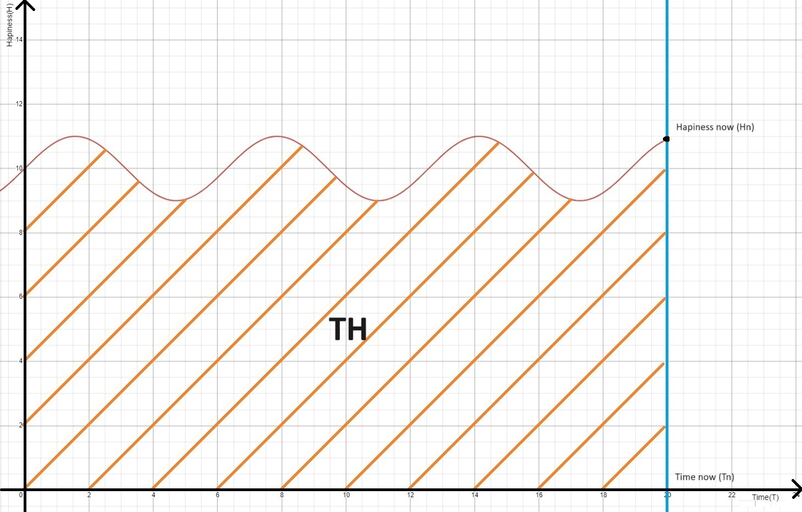

# Основний принцип, який реалізується у всіх перерахованих ролях:

**Максимізація *стійкого* щастя протягом життя та уникнення нещастя** 

В загальному сенсі передбачає вироблення такого характеру, звичок і навичок, які сприятимуть діям, націленим на довгострокове покращення власного добробуту. Якщо умовно уявити добробут як добуток часу та твого щастя в цей момент часу - **T(Час) \* H (Щастя) = TH**, то стає зрозуміло, що це досягається шляхом збільшення терміну життя та щастя в кожен конкретний момент. Також з цього випливає, що будь-яке відносно коротка робота, націлена на поліпшення щастя (навіть у незначній мірі) є пріоритетною, навіть якщо зменшує щастя в момент самого проведення часу. Зазвичай таке робота передбачає отримання чогось, що буде тобі довго служити. Якщо говорити про підвищення щастя в майбутньому, то це побудова стосунків з близькими, набуття знань/навичок, закриття матеріальних і нематеріальних боргів, або відсутність переживань на тему малоймовірних або не дуже болючих проблем, коли за свою відсутність турбот ми платимо потім, але в цілому менше, ніж якби переживали постійно (не закриті двері при виході; крадіжка автомобіля, який не на стоянці і т.д.). При цьому потрібно слідкувати за балансом **щастя теперішнього (Hn - Щастя зараз)** проти **щастя майбутнього (Hf - Щастя майбутнього)**, розуміючи, що якщо весь час жертвувати теперішнім щастям заради щастя майбутнього, через невизначеність T, можна отримати нижчий кінцевий результат.


## Ролі:

**Я**

**Внутрішній голос**

*Суддя* - справедливість та об'єктивність якого забезпечує втілення місії в справу. Його роль у всіх ситуаціях - давати оцінку діям і подіям, узгоджену з цією місією. Не давати миттєвим бажанням і спокусам відхилитися від окресленого плану і принципів.

**Тіло**

*Здоров'я*

Здоров'я - один з основних факторів, який найбільше впливає на моє щастя протягом життя, тому я активно слідкую за своїм здоров'ям. Я проходжу профілактичні огляди, активно займаюся лікуванням гострих і профілактикою хронічних хвороб. Я веду спосіб життя (харчування, спорт), який сприяє підтримці поточного і збереженню майбутнього здоров'я. Важливим пріоритетом є заходи, які допоможуть зменшити погіршення якості життя ближче до літнього віку. Маючи сидячий спосіб життя, я хочу додати в життя активні види проведення часу, намагаючись знайти хобі, які дадуть більше здорового руху в життя. Також я дбаю про те, щоб час, який я проводжу сидячи, проходив з меншим шкодою для здоров'я (правильна постава, перерви з зарядкою).

*Краса*

Я вважаю, що краса не є визначальним властивістю для людини, але не недооцінюю її значущість, я слідкую за своєю фізичною формою та станом шкіри. Атлетична зовнішність не є метою, але при наявності зайвого часу я виділяю частину на те, щоб наблизитися до неї.

**Буддист**

*Основи*

Познайомившись з буддизмом, я дізнався про проблеми, які несе в собі прямолінійний підхід до максимізації **TH**, якому слідує більшість людей, і я в тому числі. Він заключається в прагненні до всього, що приносить задоволення, і уникненні всього неприємного. Проблема полягає в тому, що миті щастя в такому підході в момент отримання задоволення сильно малі порівняно з тим часом, яке ти проводиш у прагненні до нього, і весь час, відведений на прагнення до задоволення та уникнення нещастя, наповнене почуттям неповноцінності (внаслідок відсутності речей, з наявністю яких ти став би повноцінним/щасливим), страхом втратити речі, які забезпечують твоє щастя, і уникненням та страхом відчути нещастя. Доповнивши знання, отримані з буддизму, останніми дослідженнями в області науки, стає зрозуміло, що плинність щастя є біологічним еволюційним механізмом, що стимулює поведінку, спрямовану на виживання та розмноження. Особливостями еволюційного будівництва наших біологічних процесів є те, що для успішного природного відбору людина не обов'язково повинна бути щасливою, їй всього лише потрібно створити більше копій свого ДНК. Більше того, з точки зору цього підходу та суворих умов конкуренції на Землі, бути щасливим шкідливо, адже щасливим людям не потрібно ховатися від небезпек, шукати їжу чи виховувати потомство. В результаті ми отримуємо ситуацію, в якій наші біологічні процеси налаштовані на успішність виду, але не піклуються про щастя і благополуччя окремо взятого індивіда.Відповідно, в результаті ми маємо початкові умови задачі, які заважають досягти стійкого щастя, оскільки людина швидко до нього звикає, і воно зникає.

З точки зору буддимзму, щастя - це не тоді, коли ти відчуваєш позитивні емоції і не відчуваєш негативні, а скоріше навіть навпаки, коли ти відчуваєш сприйняття та гармонію всередеині незалежно від своїх емоцій та оточення. Відповідь, яку пропонує буддизм, полягає в тому, щоб відокремити себе від думки і емоції та навчитися сприймати їх такими, якими вони є, не намагаючись робити те, що спонукає тебе робити твоя природа - уникати негативних емоцій або прагнути до позитивних. В деякому розумінні найкращим прикладом цього є перегляд фільму - ми асоціюємо себе з персонажами, переживаємо негативні та позитивні емоції, але при цьому відкриті до цього та вітаємо ці емоції запрошуючи їх в наше життя(так як ми дивимось кіно, знаючи, що воно викличе сум або страх, але все одно обираємо подивитися його).При цьому не можна застосувати буддизм лише до негативних емоцій і продовжувати насолоджуватися позитивними, адже позитивні емоції йдуть в парі з негативними емоціями, пов'язаними з відсутністю позитивних. В результаті ціль - шляхом припинення фарбування речей в чорне і біле, відмовитися від залежності свого стану від оцінок навколишнього світу та створити стійкий стан самодостатності, яке будується на внутрішньому собі. Також буддизм проповідує співчуття до інших істот (не тільки людей), які насправді опинилися в тій же еволюційній пастці, що й ти, і насправді намагаються досягти тих же цілей, що й ти, відповідно, ви можете допомагати один одному в тому, щоб прийти до того ж внутрішнього рівноваги. Ще одна ідея, запропонована буддизмом, є усвідомлення відсутності речей самих у собі, що немає чогось, що можна було б назвати словами "я", "він", "вона" - це всього лише абстракції, створені для спрощення розуміння та виживання у світі (добре для мене, погане для ворога), але насправді речі є похідним від впливу всього іншого і при цьому не є постійними, а змінні, рухомі. Протиставляється сприйняття світу як набору незалежних одиниць, світу в безперервній, непостійній, змінній, взаємозалежній масі. Метод, яким буддизм пропонує досягти просвітлення (практичного розуміння усвідомлення всіх цих ідей та втілення їх у собі) - це медитація, практика чуттєвого переживання усвідомленості, яка дає можливість відділити себе від думок, емоцій, а також спостерігати непостійність і безперервність світу навколо. По суті, дати можливість собі сприйняти ідеї буддизму не аналітично, а пережити це на практиці, для того щоб закріпити це в собі.

На перший погляд здається, що буддизм суперечить всьому викладеному в цій місії, у вигляді уникнення нещастя і максимізації щастя, але я вважаю, що це по суті не лінійний/не прямий спосіб досягти однієї і тієї ж мети. Різниця полягає в тому, що стандартний шлях пропонує в графіку кривої твого стану, прибрати провали і максимізувати підйоми, що навіть на словах не реально, оскільки підйоми можуть бути підйомами, лише на фоні провалів. Якщо ж ми говоримо про плато хорошого стану, то це не реалізується через біологічні особливості нашого організму. Шлях же буддизму пропонує вирівнювання кривої, сприйняття невдач як чогось нормального, і те ж саме з подарунками долі, таким чином модулюючи криву і наближаючи її до прямої. По суті, вимірюючи своє щастя як площу, описувану цією кривою **TH**, і виходячи з недоліку стандартного підходу, в якому **THmax** (час задоволення, яке збільшує площу) сильно меньше **THmin** (час неповноцінності, яке зменшує площу), ми приходимо до відповіді, де **Hmin**  вирівнюється з **Hmax** і стає константою, і отримуємо форму, схожу на прямокутник. Як же тоді віднести основний принцип, наведений на початку, до викладеним вище? Я вважаю, що відповідь полягає в тому, що ми переосмислюємо значення слова **уникати** - таким чином, що замість фізичного уникання людей і предметів, що викликають нещастя, я припускаю інший шлях, що передбачає зміну свого сприйняття так, що нещастя перестає бути нещастям, а стає набором подій без оцінки, які сталися з моєю життям, як вітер, який подув і зник. А **максимізація щастя** - досягається шляхом розвитку у собі навичок, які допоможуть проявляти свою позитивну сторону (позитив, співчуття до інших, цікавість до навколишнього світу) на якомога більшому проміжку життя, включаючи умовно "чорні" і "білі" смуги, що дасть можливість відчувати себе щасливим у цей час.



*Практика*

Я розумію, що можу не досягти нірвани та повного просвітлення, яке б максимізувало константне значення мого щастя, але вважаю, що навіть якась проміжна точка є досягненням і дає мені краще значення **TH**. Проміжний стан передбачає наявність у мені старого сприйняття, заснованого на лінійному підході, а також початків нової самоусвідомленої поведінки. Моя мета — шляхом чуттєвої та аналітичної медитації переходити від старого до нового сприйняття. На практиці я намагаюся сприймати злети та падіння як можливість тренувати свою усвідомленість і приймати їх як урок. У випадку, якщо не вдається впоратися з ситуацією цим шляхом, я справляюся старим способом, який передбачає фізичне уникнення страждання.

**Особистість**

*Розвиток*

Як особистість, я спостерігаю за оточуючими людьми і намагаюся отримати від них знання, звички і поведінку, які поліпшать моє **TH**. Для цього я намагаюся збільшити кількість спілкування з людьми, які можуть це дати, і шукаю нових. Ще одним джерелом цієї ж інформації є книги з саморозвитку, я проводжу час, читаючи книги і оновлюючи свою місію, якщо потрібно, або знаходжу в них способи кращої реалізації описаних тут принципів. Мені подобається змагатися з минулим собою в навичках у якихось напрямках, це дає можливість поглянути і усвідомити себе в минулому, вимагає уважності до себе теперішнього і дає відчуття руху і розвитку себе. Але є мінус в тому, що сам підвищуєш планку собі в розслабленому і розміреному темпі, тому круто, коли вдається знайти когось майстерного в тому, в чому я намагаюся поліпшитися, я відразу сильно підвищую собі планку + розумію, як потрібно мислити і діяти, щоб опинитися там. Також класно знаходити крутих людей в якихось навичках, над якими я не працюю, але дивлячись на них, я розумію, що це корисні навички, і я хочу теж у них прокачатися, окремий плюс в тому, що раз це щось, над чим я не працював, то, ймовірно, й скіл у мене базовий, відповідно, прокачка зможе захопити мене надовго.

*Розваги*

Я намагаюсь сприймати життя як комп'ютерну гру, де ти граєш головним героєм, і твоя ціль як гравця - провести час за грою якомога цікавіше. Я думаю з точки зору того, щоб збагатити свою гру цікавими квестами, змаганнями, відносинами. Для цього ти прокачуєш своєму персонажу необхідні характеристики та навички, які б відкрили доступ до нових цікавих областей гри. Такий світогляд розширює аналогію з переглядом фільму додаючи можливість впливати на перебіг сюжету, допомагає відокремити себе від почуттів і думок(так само як я відокремлюю себе від персонажа в грі), сприймати труднощі як черговий квест(що змінює думки від "коли ці труднощі зникнуть?" до "цікаво як я зможу їх пройти та як можна буде випробувати мої вміння?") та активно шукати цікаві активності. Додатковим бонусом йде те, що граючи в комп'ютерну гру, ти розумієш, що якщо вона стане не цікавою для тебе, то можеш просто перестати грати в цю гру. Це розуміння дає відчуття свободи, що ти не є жертвою обставин і закритий в клітці, а кожного разу приймаєш свідоме рішення грати в цю гру і діяти так, а не інакше.


**Інші люди**

*Загальні принципи*

Головні риси характеру людини, які я ціную в інших, і які підвищують моє бажання зміцнити та розвинути з ними стосунки, — це доброзичливість, щирість та надійність. Доброзичливість потрібна для того, щоб зрозуміти, що ці люди несуть з собою позитивний досвід і поширюють його на інших. Щирість — для того, щоб зрозуміти, що можна вірити в прадивість їхньої доброзичливості та довіряти їй. Надійність — щоб розуміти, що на людину можна розраховувати і покладатися, адже як можна розраховувати на людину, чиї дії слабо співвідносяться з його словами? Основна ідея, яка розкривається в моїх стосунках з іншими людьми, — це віра в те, що людина поширює своє світогляд, настрій, духовний стан на всіх навколо (якщо людина в депресії, то вона поширює її на оточуючих; якщо вона щаслива — робить щасливими всіх оточуючих) і факт того, що спілкування з людьми та спроби зрозуміти їхній життєвий досвід і мотивацію є відносно простим способом отримання знань і досвіду (вчитися на чужих помилках). Виходячи з цього, щоб примножити "добрі" стани, мені потрібно оточити себе якомога більшою кількістю людей з такими станами і зменшити кількість людей з "поганими" станами. Це включає:

- Допомагати людям у своєму оточенні розвивати "добрі" стани та позбавлятися "поганих", якщо ми однаково їх трактуємо
- Додавати в оточення нових людей з "добрими" станами або людей, які прагнуть до таких.
- Зменшувати кількість взаємодій з людьми з "поганими" станами, які не хочуть від них позбавлятися
- Зберігати та примножувати спілкування з людьми з "добрими" станами настільки, наскільки люди готові до цього примноження.

Ключовим у розвитку "добрих" станів я вважаю розвиток людини як особистості шляхом відмови від поглядів, звичок, які деструктивно впливають на особистість, і заміни їх на такі звички та погляди, які створюють нові можливості, розкривають його потенціал і підвищують мотивацію до конструктивної поведінки. Мої методи допомоги в розвитку "добрих" станів включають:

- Особистий приклад.
- Позитивний фідбек.
- Поширення знань і досвіду, які сприяли розвитку моїх "добрих" станів.
- Висвітлення поглядів і звичок, до яких схильна людина, які призводять до її нещастя, та поради щодо їх усунення та заміни.
- Дії, інтенсивність яких залежить від справ самого людини

Кількість моїх вкладених зусиль залежить від двох факторів:

- **Потенціал** — люди за своєю природою мають різну інертність і потенціал, відповідно я співвідношу свої дії з можливим майбутнім виграшем (від дивідендів у вигляді поширення цим людиною "добрих" станів на інших у майбутньому внаслідок мого впливу).
- Баланс на нашому **емоційному банківському рахунку (ЕБР)** з цією людиною (чим довша і більш позитивна історія взаємодії з цією людиною, тим більше зусиль і навпаки).

По суті, ролі, описані нижче, будуть відрізнятися тільки різною мірою розвитку цих двох факторів, які будуть визначати кількість вкладених мною зусиль у їх розвиток.

Також незалежно від характеру поточного стану людини, якщо я вже знаходжуся у взаємодії з нею, я хочу максимально зрозуміти цю людину за відведений нам час. Зрозуміти — значить почути її погляди на життя, розібратися в причинах таких поглядів і в життєвому досвіді, який їх спричинив. Якщо я вважаю ці погляди узгодженими і більш ефективними з точки зору **ТН** ніж мої, я прагну прийняти їх у свою карту світу.

Я виокремлюю два основних види взаємодії з іншою людиною: **слова** і **дії**.

В **словах** я щедро ділюся своїм досвідом, переживаннями і навичками і ціную, коли отримую таке ж назад. Якщо я бачу відкритість людини до сприйняття мого досвіду та знань, я готовий надати їх у великій кількості, оскільки це відносно дешевий для мене спосіб принести максимальну користь і підвищити **ТН** іншої людини. Я умовно ділю спілкування на 3 рівні, кожен наступний доповнює і розширює попередній:

- Розмова про події — розмови про навколишній світ на поверхневому рівні, розповідь про події та факти у своєму житті.
- Розмова про свої погляди на події — розширює попередній рівень, доповнюючи його своїм ставленням до подій, частково розкриває особистість співрозмовника.
- Розмова про принципи, характер — розширює попередній рівень, доповнюючи його принципами, парадигмою, на якій будуються погляди людини, розкриває суть співрозмовника настільки, наскільки він сам себе знає.

З трьох рівнів останній є найбільш бажаним, і я прагну перейти до нього з усіма людьми, які до нього відкриті. Я готовий зробити перший крок на кожному рівні і розкрити себе, щоб створити умови для поповнення **ЕБР** і взаємного розкриття. Найбільш бажаним він є, оскільки:

- дає можливість дізнатися і зрозуміти людину найбільше, таким чином розвиваючи ваші стосунки ще глибше;
- дає найбільше матеріалу і знань для власного розвитку;
- дає можливість тобі і співрозмовнику розкритися і відчути себе зрозумілим, почутим.

В **діях** я більш обережний, оскільки вони є більш трудомісткими і вимагають розуміння співвідношення зусиль до вашого поточного **ЕБР**. Я схильний давати більше, ніж брати, а це є програшем, оскільки веде до асиметричних стосунків, в яких ти рано чи пізно почнеш вважати іншу людину боржником, а друга людина може відчувати себе винною, і це не сприяє гармонійному розвитку стосунків. Окрім цього, люди схильні переоцінювати те, що дають, і недооцінювати те, що отримують, тому важливо під час відносин вирівнювати загальне розуміння отриманого та витраченого, щоб уникнути марних очікувань. Тому, співвідносячи свої дії з нашим поточним **ЕБР** і чіткою комунікацією витрачених зусиль та отриманої користі, я забезпечую сталий і гармонійний ріст вашого **ЕБР** і стосунків.

При цьому я більш обережний з людьми, у яких відсутні щирість, доброзичливість, надійність і потенціал їх розвитку (на мій суб'єктивний погляд), оскільки вважаю, що розвиток таких людей негативно позначається на загальному добробуті суспільства. Таким чином, я роблю свій маленький внесок у розвиток і примноження загального щастя та зменшення загального страждання суспільства, яке є фоном і впливає на всіх учасників.
Завдяки своїй цілеспрямованості та фокусу на вирішенні проблем я часто потрапляю в ситуацію, в якій: a) людина з різних причин не хоче вирішувати свої проблеми, і її влаштовує теперішній стан, хоча це й суперечить її словам, згідно яких вона страждає від цих проблем (позиція жертви); b) я, почувши про страждання людини і деклароване незнання можливих рішень, намагаюся придумати рішення для людини та розписати наступні кроки і алгоритм дій, допомогти людині з мотивацією і підштовхувати її до вирішення, коли вона його закинула.

В результаті виходить ситуація, в якій людина не хоче вирішувати проблему, а я борюся не тільки з проблемою, але й з людиною, щоб її вирішити. Це сильно виснажує мій ресурс, створює для мене очікування в тому, що це буде цінуватися потім, і що людина, після того як ми (або тільки я) доклали стільки зусиль для пошуку рішень, почне рухатися до цього рішення. Але насправді через відсутність реального бажання щось змінюати рідко дає результат, і ще рідше він вартий усіх моїх зусиль, але стабільно приносить страждання мені і, напевно, самій людині також. Знаючи таку свою особливість, я прагну бути дуже обережним у допомозі людям з їх проблемами, які цього не просили і самі для цього нічого не робили. Мої перші кроки повинні бути націлені не на вирішення проблеми, а на розуміння щирості (в тому числі перед собою) людини. Для цього я спершу цікавлюся, як довго у людини ця проблема, які рішення воно обдумала, які з них вона спробувала втілити, які були труднощі з цим — таким чином я розумію, наскільки фактично людина прагне до вирішення. Наступний крок — дати пораду щодо рішення; якщо на кілька порад я чую малозрозумілі відмашки, я припиняю. Даючи пораду, я не формую жодних очікувань щодо втілення її людиною, і тим більше не прикладаю жодних дій. Якщо через якийсь час я знову чую про ту ж проблему, я запитую про мою пораду; якщо вона жодним чином не застосовувалася або ж застосовувалася, але наполовину без старань — я не намагаюся давати нові. Я не намагаюся створити мотивацію у людини для вирішення проблеми. До своїх зусиль у допомозі я вдаюся **тільки** тоді, коли людина прийняла пораду, активно її спробувала, активно просить ще консультацій і показує свою мотивацію в русі по цьому шляху.


**Хлопець**

*Загальні положення*

Моя дівчина — це людина, з якою я проведу більше всього часу в своєму житті, відповідно її стани будуть впливати на моє **H** більше, ніж стани будь-якої іншої людини. Для неї я хочу бути тим, з ким вона зможе поділитися будь-якими своїми думками (добрими, поганими, неприємними) без сумнівів, чи варто це робити. Я прагну зрозуміти її більше, ніж кого-небудь іншого, вислуховую її думки та погляди, намагаючись їх ввібрати, адже чим більше ми схожі, тим краще нам буде проводити час разом. Я визнаю наявність поглядів, які можуть суперечити моїм, і поважаю їх, адже вважаю, що ключ до здорових відносин — це рівноправні відносини, де думка кожного важлива, і кожен має сильну, самостійну і розвинену особистість.

Асиметричні відносини я вважаю безперспективними, адже вони створюють монополію, пригнічують потенціал іншого і позбавляють відносини різноманітності. Я намагаюся ділитися своїм щастям з нею скрізь, де можливо, адже це збагачує мої переживання. Також я прагну бути частиною щастя партнера, щоб ще більше поліпшити її переживання. У моменти складнощів я прагну приймати рішення разом і враховувати інтереси всіх сторін. У моменти її невдач я намагаюся зберегти баланс між наданням підтримки та допомогою в їх вирішенні.

У загальному я прагну застосовувати до партнера ті ж принципи, що і до себе, враховуючи особливості партнера, які можуть передбачати трохи іншу конфігурацію максимізації її **TH** (що є кінцевою метою моїх дій). Забезпечуючи високий **TH** свій і **TH** партнера, через розповсюдження станів ми досягаємо синергії, отримуючи формулу 1+1=3.

Прагнучи бути гнучким і йти їй на зустріч, я також стежу за тим, щоб не накопичувалася велика кількість дисбалансу в відносинах, адже розумію, що це веде в довгостроковій перспективі до відносин lose-win з мого боку, і в підсумку всі втрачають. Для цього я чесно і прямо кажу, коли вважаю, що віддаю занадто багато або отримую мало, з метою відновлення балансу чи вирівнювання наших поглядів на поточний баланс. Пам’ятаємо, що часто ми віддаємо те, що, можливо, не так сильно потрібно іншому, тому важливо комунікувати в таких випадках, щоб зрозуміти, де неправильна оцінка.

Важливим для відносин є цінування свого щастя та комунікація своїх бажань та очікувань партнеру навіть, якщо вони можуть засмутити партнера. Це допомагає всім сторонам озвучити свої позиції та шукати спільного рішення, яке б залишила всіх щасливим. Таким чином досягається відкритість та спільна турбота про ваші відносини в яких цінується кожен з вас. Такий підхід дає можливість не сприймати себе слугою відносин та позбутися соціальної ролі "чоловіка" який повинен жертвувати собою заради блага сім'ї, не має права на емоції та їх прояв та не має право на вразливість.

**Син**
Батьки — це люди, які вклали в мене більше всього зусиль і вплинули на формування моєї особистості більше за всіх, а також є джерелом постійної безумовної любові і підтримки. Я ціную це і намагаюся віддячити їм тим же, допомагаючи їм у їхньому житті по мірі можливостей і даруючи нові враження і емоції. Я намагаюся зміцнити наші стосунки і регулярно поповнювати наш **ЕБР** через спілкування, спільні приємні моменти і підтримку. Я дбаю про їхнє здоров'я, щоб продовжити тривалість і якість спільно проведеного часу. Я визнаю свою дратівливість і прагну бути більш терплячим, коли наші очікування не збігаються, і зберігати любов і співчуття в моментах, коли вона випробовується через непорозуміння.

**Друг**
У порівнянні з іншими ролями мені складно визначити і чітко окреслити, як люди потрапляють і йдуть з цього кола. Для мене це поняття більше являє собою не двоїстий характер (друг/не друг), а більше безперервну і необмежену шкалу (як температура), значення якої залежить від рівня вашого спілкування, вашого **ЕБР**, доброзичливості, щирості та надійності. Оскільки на моє щастя впливає кількість моїх глибоких соціальних зв'язків, і невеликий відсоток загальних зв'язків досягає цього рівня, я свідомо намагаюся розширити свій круг друзів, додаючи щирих і доброзичливих людей, і прикладаю зусилля для їх розвитку.

Спочатку я націлений на максимально глибокі стосунки з кожним новим другом, готовий зробити перший крок як у сторону розширення кола, так і в сторону поглиблення зв'язків, а потім спостерігаю за сприйняттям цього з боку іншої людини і її відкритістю до зміцнення наших відносин. Якщо немає якихось обмежень, у цьому процесі немає меж.

**Професіонал**
Оскільки я прагну розширити коло друзів, а колеги — це люди, з якими я провожу багато часу, у мене є достатньо можливостей зрозуміти людину і вирішити, чи хочу я когось перевести в клас друзів. Якщо говорити чисто про професійні відносини, то перший пріоритет — забезпечити свій професійний зріст, другий — отримати максимальний кінцевий результат, досягти максимальної продуктивності. Обидві цілі мають досягатися за умови збереження в задовільному (або кращому) стані всіх інших робочих і неробочих аспектів (відносини, моральний дух, баланс роботи та особистого життя).

Ставлю на перше місце свій професійний ріст, адже розумію, що будь-яка робота тимчасова, і єдине, що від неї залишається (окрім зв'язків з іншими людьми, які зазвичай залишаються в невеликій кількості і рідко в хорошій якості, не враховуючи людей, що перейшли в коло друзів), — це мій професійний досвід. Більше того, розвиваючи свій професійний ріст, я приношу користь поточним і майбутнім компаніям та колегам, і в результаті виграють усі.

Пріоритизація ефективності обумовлена тим, що виконуючи одне і те ж завдання, ви можете отримати більше досвіду та навичок, якщо використовуватиме менше ресурсів (час, якість або вартість), що в підсумку вплине на ваш професійний розвиток. Під кінцевим результатом мається на увазі продукт або справа, над якою ви працюєте, в якісному і кількісному аспекті. На роботі частіше, ніж в інших умовах, зустрічаються більш досвідчені люди, у яких можна навчитися для підвищення своїх навичок. Також тут зустрічаються та реалізують свій потенціал люди з інших сфер, тому це плідне поле для того, щоб розширити свій кругозір і знайти нові цікаві напрямки. Аналогічно, як і в житті, я відкритий до того, щоб ділитися своїм досвідом і віддавати свій борг професійній спільноті.

**Громадянин**
Я не вважаю себе патріотом своєї країни і більше оцінюю себе з точки зору оточуючих людей в громаді, ніж державності. Умовою оцінки себе як члена суспільства я вважаю наступну картину: якщо взяти суспільство, повністю складающе з людей, схожих на мене і діючих так само, як і я — це суспільство буде процвітати чи стагнувати? Таким чином, я приділяю багато уваги тому, щоб уникати дій, які шкодять суспільству, і намагаюся робити те, що в зоні мого впливу, щоб його покращити, до тих пір, поки це не відбувається ціною мого **TH**.

**Випадковий перехожий**
В цілому я доброзичливо ставлюся до оточуючих мене незнайомих людям, але враховуючи моє нульове знання конкретної людини та відсутність якогось **ЕБР**, знаючи, що я схильний давати більше, ніж отримувати, а також враховуючи те, що існує багато людей, які користуються доброзичливістю інших для своєї вигоди, я готовий надавати посильну допомогу будь-кому, до того моменту, коли це може мати потенційну шкоду для мене.

**Житель планети Земля**
Мені подобається природа, тому я намагаюсь рухатись в бік гармонійного співіснування з нею та брати посильну участь в екологічних ініціативах для вирішення глобальних проблем навколишнього середовища.